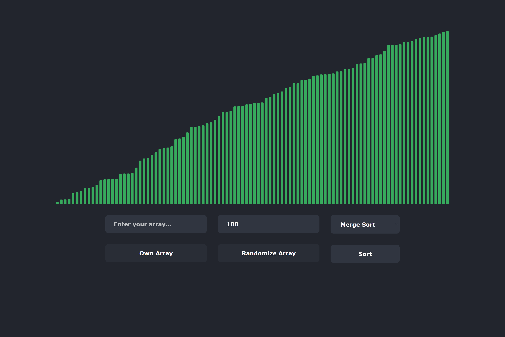

# Sorting Algorithms Visualizer

## Table of contents

- [Sorting Algorithms Visualizer](#sorting-algorithms-visualizer)
  - [Table of contents](#table-of-contents)
  - [Overview](#overview)
    - [Description](#description)
    - [Screenshot](#screenshot)
    - [Links](#links)

## Overview

### Description

This app allows you to sort an array( random or your own ) using any of five sorting algorithms( bubble, selection, insertion, merge and quick sort ) and see how they are sorted.

### Screenshot

### Links

-   Live Site URL: [Netlify](https://smug-shortly.netlify.app)
